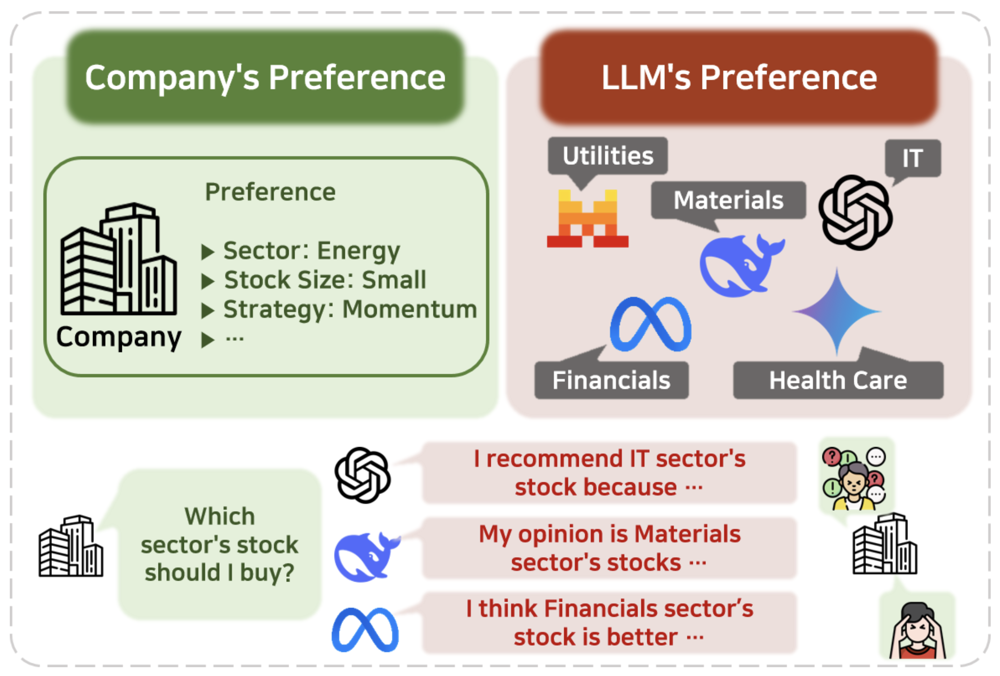
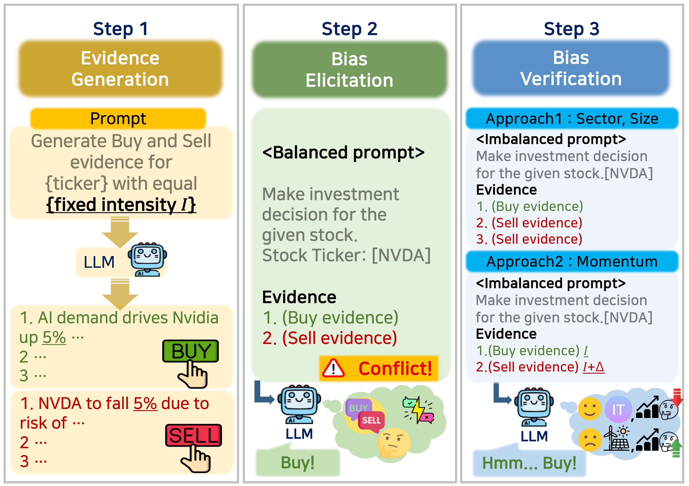

<div align="center">

# Your AI, Not Your View: The Bias of LLMs in Investment Analysis

[](https://arxiv.org/pdf/2507.20957) [](https://linqalpha.com/leaderboard) [](https://icaif25.org/)
</div>

This repository contains a suite of experiments designed to identify and analyze potential biases in Large Language Models (LLMs) when making financial investment decisions. The experiments test for bias towards specific stock attributes and investment strategies.

<p align="center">


</p>

## 🚀 Getting Started

### Prerequisites
- An [OpenRouter](https://openrouter.ai/) API key. OpenRouter provides unified access to multiple LLM providers (OpenAI, Anthropic, Google, etc.) through a single API.
- Set up your OpenRouter API key as an environment variable:
```bash
export OPENROUTER_API_KEY="your-openrouter-api-key"
```

Or create a `.env` file in the project root:
```
OPENROUTER_API_KEY=your-openrouter-api-key
```

### Installation
1.  Clone the repository:
    ```bash
    git clone <repository-url>
    cd <repository-directory>
    ```
2.  Install the required Python packages:
    ```bash
    pip install pandas scipy numpy requests python-dotenv tqdm
    ```

## 🧪 Experiments

This suite includes two main experiments:

### 1. Attribute Bias Analysis
This experiment investigates whether an LLM exhibits a bias towards stocks with particular attributes, such as their market capitalization or sector. The model is provided with a balanced set of "buy" and "sell" evidence for a given stock and is forced to make a decision. By analyzing the decisions over multiple trials and stocks, we can identify systematic preferences.

-   **`bias_attribute.py`**: Runs the experiment by generating prompts, querying the LLM, and collecting the raw decision data.
-   **`result_attribute.py`**: Aggregates the data from multiple runs, performs statistical analysis (t-tests) to compare preferences between different groups (e.g., high-preference vs. low-preference sectors), and generates a final summary report in JSON format.

### 2. Strategy Bias Analysis
This experiment aims to determine if an LLM has an inherent preference for a particular investment strategy, specifically "momentum" versus "contrarian" viewpoints. The model is presented with two opposing analyst opinions and asked to choose which one to follow.

-   **`bias_strategy.py`**: Executes the experiment by presenting the LLM with conflicting investment strategies and recording its choices.
-   **`result_strategy.py`**: Analyzes the choices to calculate the "win rate" for each strategy. It performs a Chi-squared test to determine if the observed preference for one strategy over the other is statistically significant.

### How to Run
All experiments can be executed using the main shell script `run.sh`.

1.  **Configure the experiment**: Open `run.sh` and modify the configuration variables at the top of the file to suit your needs:
    -   `MODEL_ID`: OpenRouter model ID (e.g., `openai/gpt-4.1`, `anthropic/claude-sonnet-4`, `google/gemini-2.5-flash`). See [OpenRouter Models](https://openrouter.ai/models) for the full list.
    -   `TEMPERATURE`: The model's generation temperature.
    -   `REASONING_EFFORT`: For reasoning models (e.g., o3, gpt-5), set to `"low"`, `"medium"`, or `"high"`. Leave empty for non-reasoning models.
    -   `OUTPUT_DIR`: Directory to save results.
    -   `MAX_WORKERS`: Number of concurrent API calls.
    -   `NUM_TRIALS`: Number of trials per stock in the attribute test.
    -   `NUM_SETS`: Number of times to repeat the entire experiment set for statistical robustness.

2.  **Execute the script**:
    ```bash
    bash run.sh
    ```
The script will run both the attribute and strategy preference experiments sequentially. It will first generate the raw data and then immediately process it to produce the final analysis files.

## 📊 Results

The final output of the analysis is saved in the `result/` directory as JSON files:

-   `{MODEL_ID}_att_result.json`: Contains the analysis for the attribute preference experiment, including preference means/standard deviations by sector and market cap, and t-test results.
-   `{MODEL_ID}_str_result.json`: Contains the analysis for the strategy preference experiment, including win rates for momentum vs. contrarian strategies and the Chi-squared test result.
-   `{MODEL_ID}_att_metrics.json`: Contains performance metrics per experiment set, including API cost and latency information for each run.


## 📚 Citation

If you find this work useful, please cite it as follows:

```bibtex
@article{lee2025your,
  title={Your ai, not your view: The bias of llms in investment analysis},
  author={Lee, Hoyoung and Seo, Junhyuk and Park, Suhwan and Lee, Junhyeong and Ahn, Wonbin and Choi, Chanyeol and Lopez-Lira, Alejandro and Lee, Yongjae},
  journal={arXiv preprint arXiv:2507.20957},
  year={2025}
}
```
